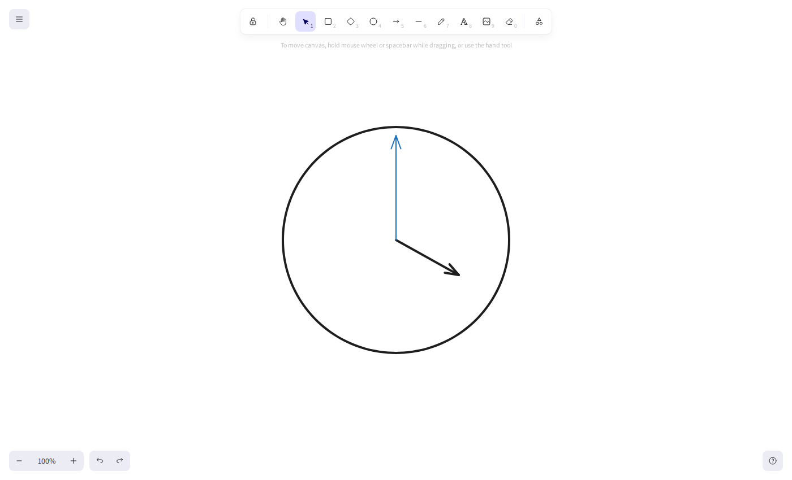
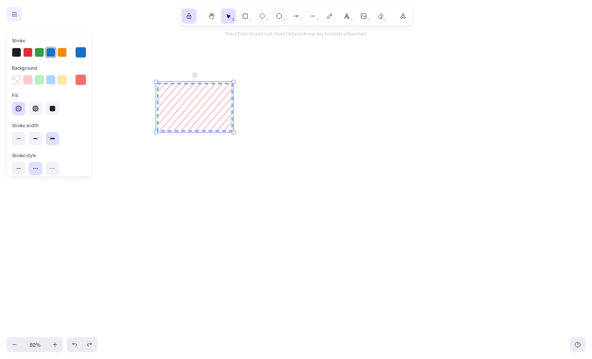
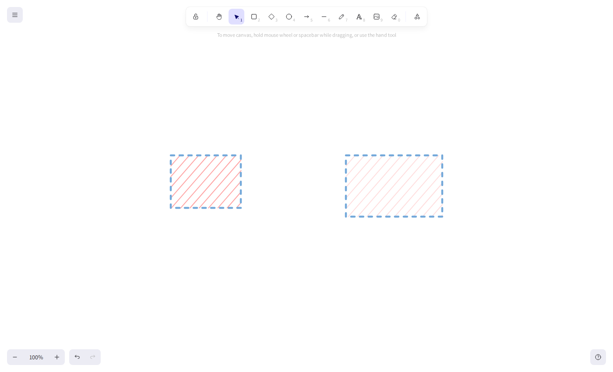
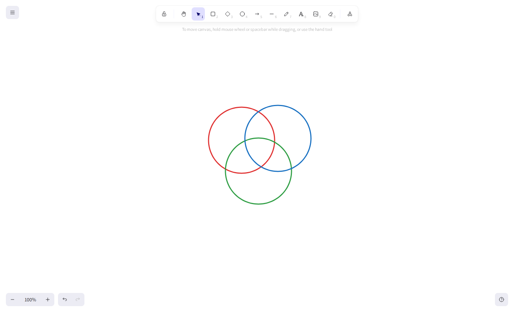
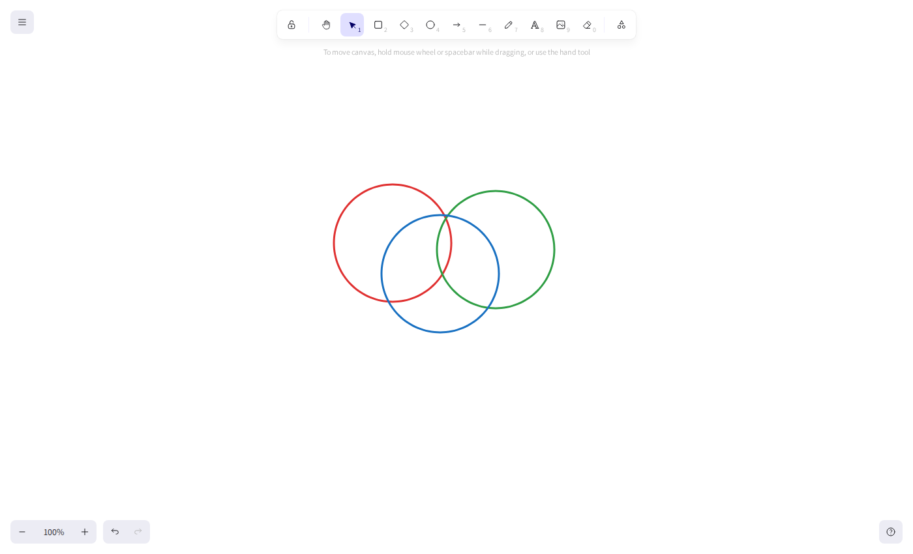
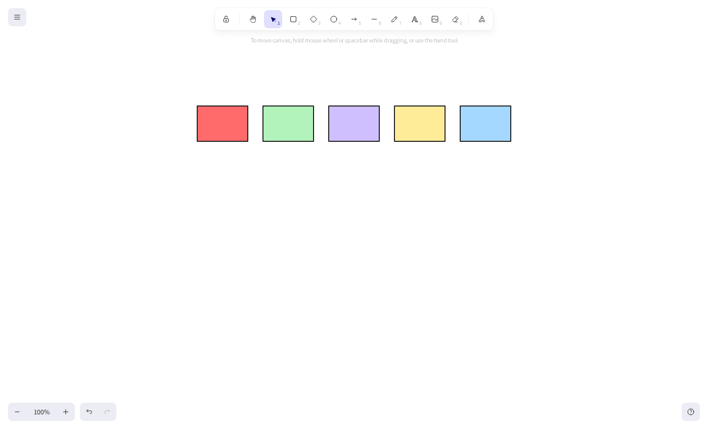
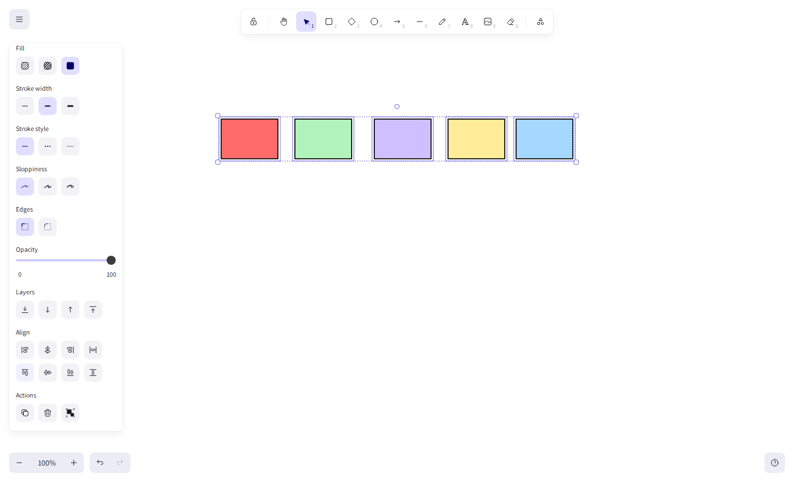

# Submission — Excalidraw RLVR Curriculum

## TL;DR

Novel browser-use tasks for `claude-sonnet-4-6` on an Excalidraw canvas, each with a
deterministic binary grader (no LLM grading anywhere) and a **distinct failure mode** — none
is the reference task's visual-containment mode. All seeds grade `0`; every grader is verified
to grade `1` on a programmatically solved state, codified as regression tests in
`tests/task/test_graders.py` (seed→0, solved→1, plus near-miss states the anti-hack rubrics
must reject).

**Four tasks calibrate inside the 10–50% `pass_at_1` window** on `claude-sonnet-4-6`, and they
probe *different capability buckets* — not one skill at several difficulties. The first three
are the headline tasks, each probing a distinctive capability with a non-obvious trap;
`align-the-row` rounds out the set by covering the alignment/distribution toolbar:

| Task | Capability probed | Failure mode (distinct from containment) | `pass_at_1` |
|------|-------------------|------------------------------------------|-------------|
| `set-the-clock`    | Turn a hand to a precise bearing while keeping it anchored | Uses the rotate handle (pivots about the hand's middle, detaching its base); or turns the wrong way | **20%** (1/5) |
| `arrange-the-venn` | Three-set spatial arrangement (circle geometry) | Overlaps look right pairwise but have no region common to all three | **20%** (1/5) |
| `match-the-style`  | Multi-property style transfer via the style panel | Partial transfer — copies the fill color but misses fillStyle / strokeStyle / opacity | **40%** (2/5) |
| `align-the-row`    | Alignment / distribution toolbar (breadth) | Hand-dragged "roughly tidy" row — tops not flush, gaps uneven | **20%** (1/5) |

Numbers are computed from `calibration/claude-sonnet-4-6.yaml` as `sum(scores) / attempts`.

## Calibration results

Live calibration was run against `claude-sonnet-4-6` with the frontend up. Full results:

| Task | Attempts | Passes | `pass_at_1` | In 10–50%? |
|------|----------|--------|-------------|------------|
| `set-the-clock`        | 5  | 1  | 20% | ✅ |
| `match-the-style`      | 5  | 2  | 40% | ✅ |
| `arrange-the-venn`     | 5  | 1  | 20% | ✅ |
| `align-the-row`        | 5  | 1  | 20% | ✅ |

All four submitted tasks land in the 10–50% window. During development I also built and
calibrated three tasks that fell outside it; I cut them from the shipped set and summarise what
they taught me under [Calibration findings](#calibration-findings).

To reproduce:

```bash
cd app && pnpm install && ./dev.sh           # frontend on http://localhost:3001 (separate terminal)
echo 'OPENROUTER_API_KEY=sk-or-...' >> .env
for t in set-the-clock arrange-the-venn match-the-style align-the-row; do
  uv run calibration run --task "$t" --attempts 5 --model claude-sonnet-4-6
done
```

## Thought process

The reference task (`yellow-circle-in-blue-box`) probes one thing: visual containment of one
shape in another. It already scores ~60% on prior Claude models, which told me two things:
(1) difficulty in this gym comes from **UI-tool friction, precision, and judgment**, not from
the number of actions; and (2) a good curriculum should fan out across *different* capabilities
rather than re-skin the same containment check at different sizes.

So I built tasks that each stress a different part of the agent loop — *observe (screenshot) →
reason → act (mouse/keyboard) → repeat* — and made sure no two share a failure mode. Each
grader reads only the Excalidraw JSON returned by the canvas state; there is **no LLM grading**.
The four submitted tasks pick one failure surface each:

- **Rotation about a pivot** → `set-the-clock` (turn a hand to a precise bearing while keeping
  its base anchored — the rotate handle is a trap, it pivots about the element's middle).
- **Multi-set spatial reasoning** → `arrange-the-venn` (three circles into a true Venn — every
  pair overlaps *and* a region is common to all three; a loose row of overlaps fails).
- **Exhaustive property transfer** → `match-the-style` (replicate six independent style fields
  through the style panel; partial transfers that *look* close still fail).
- **Toolbar discovery (breadth)** → `align-the-row` (flush tops + equal gaps, impractical to hit
  by hand-dragging — the reliable path is the multi-select align/distribute controls). The most
  conventional of the four; included so the curriculum also covers the alignment toolbar, a UI
  surface none of the others touch.

Because the failure modes are independent, the four tasks probe genuinely different
capabilities rather than one skill at several difficulties. Their empirical `pass_at_1` values
land between 20% and 40% (20 / 40 / 20 / 20) — toward the harder end of the window, with
`match-the-style` the most attainable.

## Per-task detail

### `set-the-clock` — turn a hand to a precise bearing, anchored at a pivot  · 20%
- **Seed:** a clock face (ellipse) with two hands (arrows), both pointing up to the 12.
- **Goal:** turn the hands so the clock reads **4:00** — the short hour hand to the 4
  (lower-right, 120° clockwise from 12), the long minute hand left at the 12 — with both hands
  staying attached to the clock's center (stated in the prompt, so the reward is unambiguous).
- **Grader:** face preserved; exactly 2 hands; **`hands_anchored_at_center`** — each hand's base
  endpoint (recovered from `points` rotated by the element `angle` about the bbox center, exactly
  as Excalidraw renders) within 30px of the pivot; each hand's **bearing** (base → tip, clockwise
  from 12) within ~11.5° of its target. Hands are told apart by length (longer = minute).
- **Why it's hard / distinct:** the natural-looking tool is a trap — Excalidraw's **rotate handle
  pivots an element about its own middle**, so rotating the hour hand detaches its base from the
  center and fails the anchor rubric. The agent must drag the hand's *tip* instead. Other failure
  modes: imprecise bearing and **wrong direction**. The rotate-handle-detach near-miss grades `0`
  in `tests/task/test_graders.py`.

### `arrange-the-venn` — three-set spatial arrangement  · 20%
- **Seed:** three circles (red, green, blue ellipses) spread out in a row, none touching.
- **Goal:** move them into a proper three-set Venn — every pair overlaps, and all three share a
  central region — **without resizing** and without collapsing them onto the same spot.
- **Grader:** all geometry from exact circle math (center distance vs. radii), so the result is
  independent of *how* the agent moved the circles. `three_circles_preserved`; **`radii_unchanged`**
  (anti-hack: forbids blowing one circle up to swallow the others); **`centers_distinct`**
  (anti-hack: forbids stacking concentrically); `all_pairs_overlap`; **`shared_center`** — the
  centroid of the three centers lies inside all three circles by a margin, guaranteeing a real
  common core.
- **Why it's hard / distinct:** the trap is a **loose row of pairwise overlaps** that *looks* like
  a Venn but has no region common to all three — `shared_center` is exactly the rubric that
  catches it. This is multi-constraint spatial planning, distinct from single-shape positioning.
  The loose-overlap, concentric-stack, and giant-circle near-misses all grade `0`.

### `match-the-style` — multi-property style transfer  · 40%
- **Seed:** two rectangles — a heavily styled reference on the left (red hachure fill, blue dashed
  extra-bold stroke, 60% opacity) and a plain one on the right. They deliberately **differ in
  size**.
- **Goal:** restyle the right rectangle so all six style fields exactly match the reference — fill
  color, fill pattern, stroke color, stroke width, stroke style, opacity — without moving,
  resizing, or touching anything else.
- **Grader:** 2 rectangles; **`geometry_unchanged`** — both keep seed position/size (since the
  sizes differ, this defeats the "duplicate the reference over the target" shortcut);
  **`reference_untouched`**; **`target_style_matches`** — all six fields equal the reference
  (opacity within ±5 to absorb the slider's step-of-10 granularity).
- **Why it's hard / distinct:** it probes *exhaustive* property replication. The classic failure
  is a **partial transfer** — the salient fill color gets copied while low-salience fields
  (fillStyle hachure, dashed strokeStyle, opacity) are missed, which looks ~right in a screenshot
  but fails the exact field check. **Calibration knob:** the number of differing style fields.
  Near-miss tests: 3-of-6 partial transfer grades `0`; duplicate-reference hack grades `0`.

### `align-the-row` — alignment / distribution toolbar  · 20%
- **Seed:** five equal-sized rectangles scattered at different heights and uneven spacing.
- **Goal:** arrange them into one neat horizontal row — all tops flush, all gaps equal, no
  overlaps, no resizing. Left-to-right order doesn't matter.
- **Grader:** **`five_boxes`** — exactly 5, each still seed size (anti-hack: no
  delete/duplicate/resize to fudge spacing); **`tops_aligned`** — top edges within 7px;
  **`in_a_row_no_overlap`** — consecutive gaps positive; **`evenly_spaced`** — gap spread within
  10px.
- **Why it's hard / distinct:** the tolerances are tight enough that a hand-dragged "roughly tidy"
  row fails — the reliable path is **multi-select → align-top → distribute-horizontally**, a
  toolbar feature nothing else in the curriculum probes. Discovering and using that batch tool is
  the skill being graded. (Calibration confirms the trap: the in-window failures are all
  `evenly_spaced` misses from hand-placed rows.)

## Examples — expected vs. agent failure

Each pair below is a real calibration run: an **expected** outcome (a passing run, score 1) next
to a representative **failure** (score 0) that the deterministic grader caught. Screenshots are
the post-attempt canvas captured by the harness.

### `set-the-clock`
<table>
<tr><th>Expected — 4:00, both hands anchored</th><th>Agent failure — hour hand detached</th></tr>
<tr>
<td></td>
<td></td>
</tr>
</table>

The agent used the **rotate handle**, which pivots a hand about its own middle — the hour hand
floated off the centre, so `hands_anchored_at_center` fails even though the bearing looks plausible.

### `match-the-style`
<table>
<tr><th>Expected — all six style fields match</th><th>Agent failure — wrong fill hex</th></tr>
<tr>
<td></td>
<td></td>
</tr>
</table>

The clearest illustration of *why RLVR grades state, not pixels*: the failure looks almost
identical (hachure fill, dashed stroke), but the target's `backgroundColor` is `#ffc9c9` vs the
reference's `#ff6b6b`, so `target_style_matches` fails.

### `arrange-the-venn`
<table>
<tr><th>Expected (score 1)</th><th>Agent failure (score 0)</th></tr>
<tr>
<td></td>
<td></td>
</tr>
</table>

Both look like three overlapping circles — and that is the point. The circles are transparent
outlines, so you can't *see* whether a substantial region lies inside all three; the difference is
geometric. The grader computes it from the centres and radii: in the expected run the centre of the
arrangement sits well inside all three circles, while in the failure the three-way overlap is only a
thin sliver, so `shared_center` fails. This is the clearest illustration of *why RLVR grades canvas
state, not the screenshot* — the eye can't tell these apart, but the JSON can.

### `align-the-row`
<table>
<tr><th>Expected — flush tops, equal gaps</th><th>Agent failure — uneven gaps</th></tr>
<tr>
<td></td>
<td></td>
</tr>
</table>

The agent found the alignment panel and lined up the tops, but the gaps still range 20–40px — it
aligned without distributing, so `evenly_spaced` fails.

## Calibration findings

During development I built and calibrated three more tasks that fell outside the window. I cut
them from the shipped set (every shipped task is in-window), but they mapped the difficulty
boundary and are worth recording:

- **`connect-the-flowchart` (100%) and `draw-with-constraints` (100%)** — arrow *binding* and
  multi-rule rectangle drawing turned out to be reliably within the agent's reach. They were clean,
  well-graded tasks (binding read from `startBinding`/`endBinding` only, not pixels), just too easy
  to count toward the window.
- **`balance-the-ledger` (0%)** — a text-editing + arithmetic task. Every run failed identically:
  the agent **never entered text-edit mode**, leaving all answer slots empty. I tried two designs
  (bound text in a cell, then free-floating text edited by double-click) and both scored 0/5. The
  reasoning design was sound and the grader accepted a correct solve, but **text editing is
  currently a dead end for this browser agent** — no task in the gym demonstrated it. A useful
  negative result about the gym's interaction surface, not a usable task.

## Generation method

- **Seeds are programmatic, never hand-written.** Each task has a `generator.py` built on the
  existing `curriculum/seed_generator.py` helpers (`SeedBuilder`, `rectangle`, `ellipse`,
  `diamond`, `text`, `bound_text`, `line`/`arrow`, Open-Color palette). Re-running it reproduces
  `seed.json` deterministically.
- **Graders follow the reference pattern.** Each uses `@rubricgrader` + `rubrics.assertTrue(...)`,
  reads `ExcalidrawProject(input["snapshots"]["excalidraw"])`, and has a `__main__` block to grade
  `seed.json` directly. Every grader pairs the goal rubric with **preservation/anti-hack rubrics**
  (counts, sizes, positions, radii intact) so the seed grades `0` and reward-hacking is hard.
- **SDK extension is additive.** `curriculum/sdk.py` gained `text`, `angle`, `group_ids`,
  `frame_id`, `container_id`, `bound_elements`, `start_binding`/`end_binding`, `points`, `index`,
  `center_x/y`, `fill_style`, `stroke_width`, `stroke_style`, `opacity`, `is_diamond/arrow/line/text`,
  `has_stroke_color`, `overlaps`, `distance_to`, and project-level `get_diamonds/get_arrows/
  get_lines/get_texts/all_elements/get_by_id`; `seed_generator.py` gained `line()`/`arrow()`. The
  reference task imports nothing new and grades identically (verified).
- **Iteration loop per task:** generator → seed → grader → confirm `run-graders` reports seed
  `score 0` → build a solved state, confirm it grades `1` → calibrate → tune the difficulty knob
  if outside 10–50% → re-run. Solved/near-miss states are committed as regression tests, so
  `uv run pytest tests/` re-verifies every grader without a browser or API key.

## Verification

```bash
uv run pytest tests/ -v          # seed→0, solved→1, anti-hack near-misses→0
```

Every seed grades `0`, and each authored task has a programmatically solved state (in
`tests/task/test_graders.py`) verified to grade `1` — so each grader is confirmed to both
reject the seed and accept a correct solve.

## Scaling to a larger curriculum

Each task is already a **parametrized template**, so scaling is mostly turning constants into
samples:

- **Parametrize the generators.** `set-the-clock` → sample target time and hand lengths;
  `match-the-style` → sample which/how-many style fields differ; `arrange-the-venn` → sample the
  three radii and separation; `align-the-row` → sample box count and scatter. One template yields
  a difficulty *family*.
- **Difficulty knobs are explicit.** Each task documents a single monotonic knob (tolerance,
  field count, separation, box count). An **auto-calibration loop** can binary-search it: run K
  attempts, nudge toward 10–50%, repeat.
- **Graders stay declarative** — small ANDed rubric sets over JSON, so a new task is "new
  generator + new rubric list" with no harness changes. The additive SDK (`overlaps`,
  `distance_to`, bindings, `get_by_id`) is the shared vocabulary new graders reuse.

## Conclusion

This submission delivers **four novel tasks, all calibrated inside the 10–50% `pass_at_1`
window** on `claude-sonnet-4-6` (20% / 40% / 20% / 20%), each probing a **distinct capability and
failure mode** — rotation about a pivot, exhaustive style transfer, multi-set spatial reasoning,
and alignment/distribution — and none reusing the reference task's visual-containment mode.

Every task is built for RLVR: a **deterministic, binary grader** that reads only the Excalidraw
canvas JSON (no LLM scoring), pairing the goal rubric with **anti-hack rubrics** so the reward
can't be gamed by deleting elements, dragging shapes apart, or duplicating a reference. All seeds
grade `0`, every grader is verified to grade a solved state `1`, and the whole suite re-checks
without a browser or API key (`uv run pytest tests/`).

The build also produced a useful map of the gym's boundary: arrow binding and multi-rule drawing
are reliably *too easy* for this agent, while **text editing is a dead end** — the agent never
enters edit mode, so arithmetic/labelling tasks bottom out at 0%. Difficulty here comes from
**UI-tool friction, precision, and judgment**, not from the number of actions — which is the
principle the four shipped tasks are designed around.
