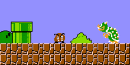

# A primer on RLVR for non natively verifiable domains

Created by: Jeremie Feron
Created time: February 28, 2026 11:50 AM
Last edited by: Jeremie Feron
Last updated time: April 1, 2026 11:48 AM

### What's RLVR?

- **The breakthrough:** If you are wondering how models jumped from chat to full scope agents capable to automate most developers' jobs (like Lovable, Cursor, Claude Code...), the answer is RLVR.
- **At the core level:** It's about putting a model in an environment where it can take actions and get programmatically rewarded when it reaches a set goal (a bit like a game if you want).



*task: “You’re playing Mario, your task is to advance through the game and pass every levels”*

### RLVR Gyms

RLVR Gyms (think of little sandboxed environments a model can learn in) are composed of 3 things:

- **The observation environment:** What's in the sandbox — a simple chat interface, a filesystem, a codebase… or even a whole computer desktop.
- **A space of actions:** The tools the models can use to interact with their environment (API calls, terminal commands, mouse clicks, keystrokes...).
- **A curriculum of tasks:** A challenging and useful set of exercises, goals, or prompts we're going to give the model to train it on.
- **A library of graders:** Deterministic code functions that are going to assess individual task completion.

### Beyond coding agents

Are RLVR environments just to make coding agents better? Yes, but not only (well we hope).

- **Expanding capabilities:** Our bet is that we can apply this paradigm to other domains than code and make models get better at all sorts of stuff: 2D whiteboarding, 3D design, accountability... your job (sorry).
- **Why it's not done yet:** Those domain are not easily verifiable by default (e.g you cannot check if a 2D whiteboard compiles) → we need to bring them into verifiable territory.

### What it looks like in practice

Let's take [Excalidraw](https://excalidraw.com/) (a 2D whiteboarding tool that allows you to draw shapes, lines, and text on a canvas) as an example.

In our setup:

- **Observation environment:** The Excalidraw website with a pre-loaded project.
- **Space of action:** Screenshots (read) and mouse clicks and keystrokes (write). This modality is called computer use.

**Now we got to give him tasks to do.**

Here is a fairly basic but actually quite challenging one for Claude Sonnet 4.6:

- *"Put the yellow circle inside the blue box"*

Let's watch Claude's attempt at it:

<video src="a-primer-on-rlvr/excalidraw.mp4" controls></video>

... it fails.

Now if you reproduce this locally and run it 10 times, you'll see it actually succeeds some of the time. That makes it a perfect candidate task for RLVR—we say it's **"calibrated"**.

Noticed how Claude hallucinates task completion in this example ? → **That's why we need deterministic graders.**

### But how do grade it?

**Environment state:**

Environments need to expose a state we can inspect in code. Luckily for us, Excalidraw relies on JSON!

**This typically looks like:**

```json
{
  "type": "excalidraw",
  "elements": [
    {
      "type": "rectangle",
      "backgroundColor": "#a5d8ff",
      "x": 7613.28,
      "y": -122.36,
      "width": 1852.46,
      "height": 1760.15
    },
    {
      "type": "ellipse",
      "backgroundColor": "#ffec99",
      "x": 12792.62,
      "y": -0.84,
      "width": 1633.9,
      "height": 1608.43
    }
  ]
}
```

**Now let's see about our graders.** The agent attempted the task, we have our end state... time to grade it.

- **Grader:** A function that is going to reward (or not) the agent after a task attempt.

```python
def grader(project_excalidraw: dict[str, Any]) -> GraderResult:
    """
    Grades an Excalidraw project.

    Rubrics:
    - has_one_ellipse: Project contains exactly one ellipse
    - has_one_rectangle: Project contains exactly one rectangle
    - ellipse_is_yellow: The ellipse has a yellow background (#ffec99)
    - rectangle_is_blue: The rectangle has a blue background (#a5d8ff)
    - ellipse_within_rectangle: The ellipse is fully contained within the rectangle

    Value mappings:
    - "yellow" → #ffec99 (Excalidraw's default yellow)
    - "blue" → #a5d8ff (Excalidraw's default light blue)
    """

    project = ExcalidrawProject(project_excalidraw)

    ellipse = project.get_ellipse()
    rectangle = project.get_rectangle()

    has_one_ellipse = ellipse is not None
    has_one_rectangle = rectangle is not None

    ellipse_is_yellow = ellipse.has_background_color("#ffec99") if ellipse else False
    rectangle_is_blue = rectangle.has_background_color("#a5d8ff") if rectangle else False

    ellipse_within_rectangle = ellipse.is_within(rectangle) if ellipse and rectangle else False

    rubrics = {
        "has_one_ellipse": has_one_ellipse,
        "has_one_rectangle": has_one_rectangle,
        "ellipse_is_yellow": ellipse_is_yellow,
        "rectangle_is_blue": rectangle_is_blue,
        "ellipse_within_rectangle": ellipse_within_rectangle,
        "Expected [x] got [y]"
    }

    grade = 1 if all(rubrics.values()) else 0

    return {"grade": grade, "rubrics": rubrics}
```

That's it, we now have a RLVR task.

### Building a curriculum of RLVR tasks

LLMs are like students — they need exercises to learn… and a lot of them. One task is not going to cut it, we need to feed them thousands.

- **Too easy:** The model gets bored and won't learn.
- **Too hard:** The model gets frustrated... and won't learn either.

That's why we need tasks in the right difficulty range (like the one above) — and that notion of difficulty is specific to the model we're training.

**Building a curriculum of tasks is a search problem:** find the intersection of deterministically verifiable tasks, doable but challenging for the model (=difficulty calibrated), and that are aligned with what a human would ask the agent.

**RLVR’s search problem**


**At Originator we specialise in solving this search problem →** finding a curriculum of calibrated tasks for a given (env, model) pair is the core of what we are doing, this is the job of the Curriculum Engineer. 

### Wait wtf... why are we doing this again?

**Because this is what it looks like when it works:**

<video src="a-primer-on-rlvr/1770314626291.mp4" controls></video>

Credit: [Anton Pidkuiko](https://github.com/antonpk1) — [excalidraw-mcp](https://github.com/excalidraw/excalidraw-mcp)

*Note: Ok so it's not raw computer use — this Claude is using an MCP. But you get the idea.*

→ beyond Excalidraw, models will be able to autonomously operate anything on your computer — Anthropic is already shipping this with [Cowork](https://claude.com/blog/cowork-research-preview).

### Where does Originator fit ?

Our value proposition is about turning any type of software interaction (terminal-use, browser-use, old legacy admin software-use….) into an RL-gym in which models can learn.  

Our clients are tier-1 US-based labs. At Originator you’ll work on helping training the models everyone uses daily. 

Software engineering is at the core of what we do but the main challenge we face is solving the [search problem exposed above](https://www.notion.so/A-primer-on-RLVR-for-non-natively-verifiable-domains-315f7e772fbb809ab4e8f639796eb15e?pvs=21). 

Formally:

```tsx
Given: 

- an environment (E) composed of space of observation (O) & space of action (A)
- a target model (M) (e.g claude-sonnet-4.6)

Find a curriculum of verifiable tasks (T) such that T:
- covers a reasonable portion of (E)
- is difficulty calibrated for model (M)
- utlimately makes model (M) better on (E) and generalize elsewhere
```

If you excited about helping advance this → Join us at Originator.